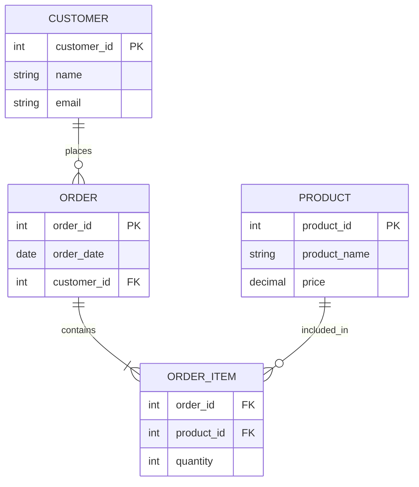

<h1 align="center">Peter Garay-Robles </h1>

<h3 align="center">A Data Engineer in Snowflake and Excel. </h3>

----

## 📌 Star Schema 

## Denormalized Data Modeling 

This project demonstrades Data Modeling and how tables are structured to Fact Tables and Dimension Tables. 

---

---

## 🎯 High-Level Overview

- Connect a One-To-Many Relationship to the Foreign Keys

1. Identify Facts from Business Activity Key Performance Indicators
2. Determine Dimensions from Attributes and Descriptions

### The "Fact Table" Holds the Keys
Customer ID's are Key points of data and Dimensions, such as Location, provide entry points for grouping Customer Sentiment Analysis by Region. 

### Result: 
Identifying parts of the Data Tables as Keys and complementary data as Dimensions result in operational efficiency when searching for Business Insights.

---

---

## 📌 Identify Facts

- Granularity & Keys 

Fact Tables are the foundation of the Data Warehouse, listed below are components of a Fact Table.

- Sales, Profit, Quanitity, Cost

### Granularity

In this case the Customer ID, Product ID, and City ID are the lowest points of Granularity that serve as Identifiers for Business Insights such as Customer Sentiment Analysis. 

---

## Dimensions Tables

- Attributes or Descriptions

Below is an Example of a Dimension table that are the outer components of the Star Schema, as shown below the Excel Model.

A Star Schema stores Related Attributes in One Dimension Table

- Month, Quarter, Year, Category, Brand, City, State, Name

---

---

---

## 📌 Data Mart

- Join Facts & Dimensions to Create Custom Views

A Data Mart can be a custom view of Total Orders by Product. A Star Schema produces a source of all the keys in a "Fact Table", allowing for Dimensions to be joined in to Create a Custom View known as a Data Mart. 

---

### The Entity Relationship Diagram (ERD)
- Data Model below is used to support Business Intelligence tools such as Power BI. 

---

