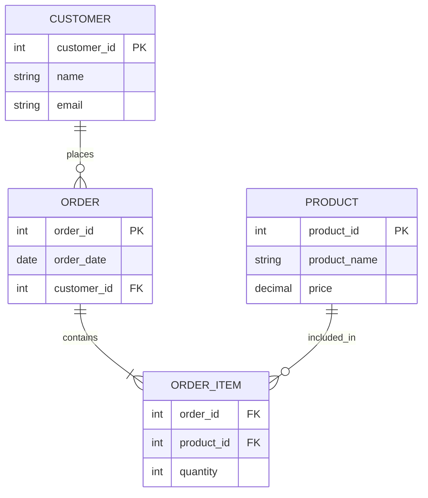

<h1 align="center">Peter Garay-Robles </h1>

<h3 align="center">A Data Engineer in Snowflake and Power BI. </h3>

----

## 📌 Star Schema 

## Denormalized Data Modeling 

This project demonstrades the Tradeoffs of data modeling techniques such as Star Schema and Snowflake Schema.

### The Entity Relationship Diagram (ERD)
- Data Model below is used to support Business Intelligence tools such as Power BI. 

---

## 🎯 High-Level Overview

- Connect a One-To-Many Relationship to the Foreign Keys

1. Identify Fact from Business Activity KPI
2. Determine Dimensions such as Attributes and Decriptions
3. Create Marts for End Users

### The "Fact Table" 
Net Promoter Score and Customer ID's are Key points of data that have been chosen to reflect urgent business priorities and Dimensions, such as Location, provide a wealth of entry points for grouping Customer Sentiment Analysis. 

However, without the location of each customer ID, we cannot group the results to produce sentiment analysis in a meaningful way. 

### Result: 
To join the Location, a "Star Schema" provides efficiency to one "Fact Table" by identifying which part of the Data Tables are Keys, and which part of the Data Tables are complementary to to tell a story.

---

## 📌 Identify Facts

- Low Granularity, Keys & Numeric Values

Fact Tables are the foundation of the Data Warehouse, therefore, we want to highlight the components of a Fact Table, listed above.

- Sales, Profit, Quanitity, Cost

### Granularity

What a single fact table record represents. The description of the measurement event. For example, when a grocery store scanner calculates the Price and Quantity of the Product Purchased the beep of the scanner is the Grain.

In this case the Customer ID, Product ID, and City ID are the lowest points of Granularity that will be valuable to provide business insights for Customer Sentiment Analysis. 

---

## Dimensions Tables

- Attributes or Descriptions

Location of each customer record allows us to group NPS score for different regions for Sentiment Analysis. 

A Star Schema stores Related Attributes in One Dimension Table

- Month, Quarter, Year, Category, Brand, City, State, Name

---

## 📌 Data Mart

- Join Facts & Dimensions to Create Custom Views

A Data Mart can be a custom view of Total Orders by Product. A Star Schema produces a source of all the keys in a "Fact Table", allowing for Dimensions to be joined in to Create a Custom View known as a Data Mart. 

---

